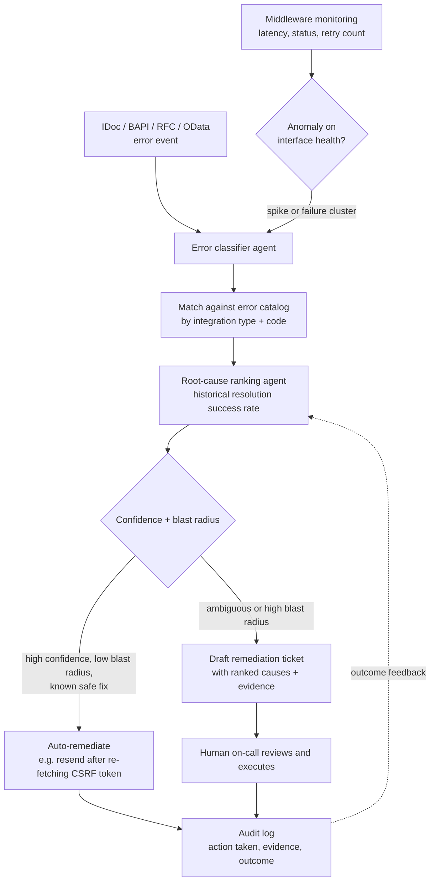

# Agentic root-cause copilot for SAP interfaces

**Domain:** Integration operations · IDoc/BAPI/RFC/OData/EDI/CPI · Agentic AI
**Status:** Reference design, buildable end-to-end against the companion synthetic dataset in this repository.

## The problem

A mid-size SAP landscape easily runs 50-200 active interfaces: IDoc flows to trading partners, BAPI calls from a portal, RFC lookups for pricing and credit checks, OData services for a mobile app, EDI exchanges with a VAN, CPI flows stitching all of it together. When one fails, the person on call sees a status code — IDoc status 51, RFC_ERROR_COMMUNICATION, OData 409 — and has to reconstruct, from memory or from a runbook nobody kept current, what that code usually means, which of the six or seven likely causes applies this time, and whether it is safe to just reprocess or whether reprocessing will double-post a transaction.

That reconstruction work is exactly what a language model does well, and exactly what generic anomaly detection does not do at all: anomaly detection tells you an interface is behaving unusually, not what to do about it in this specific case. The interface monitoring dashboards most teams already have (latency, status, retry count) tell you *that* something broke. They don't tell you *why*, and they don't propose a fix ranked by how often that fix has actually worked before.

## Architecture

The core idea: separate *classification* (what is this error, using the deterministic error catalog) from *ranking* (which of the possible causes is most likely this time, using history) from *action* (auto-remediate only within a tightly scoped, pre-approved action set). An LLM is trusted to draft and rank, not to execute anything with side effects beyond a pre-approved, reversible action list.

**Blast radius matters more than confidence alone.** A misclassified IDoc that gets reprocessed twice can double-post a financial document — that's why duplicate detection (`ERR-0009` in the catalog below) sits behind a hard idempotency check, not just a confidence threshold, before any auto-remediation path touches it. Auto-remediation should be reserved for actions that are safe to get wrong: refreshing an expired OAuth token, re-fetching a CSRF token before a retry, re-triggering a stuck background job. Anything that changes business data goes to a human, every time, regardless of how confident the ranking agent is.

**The error catalog is the ground truth, not the model.** A model can be plausible and wrong about SAP error semantics — status code 64 looks alarming ("IDoc ready to be transferred") but is usually just a stalled background job, not a data problem. Grounding the classifier in a maintained catalog of integration-type + error-code + likely-cause + resolution-steps (see the [pattern and error catalog](../patterns/integration-patterns-catalog.md)) keeps the agent from hallucinating a plausible-sounding but wrong diagnosis, and gives the ranking step something concrete to rank against.

## Data this pattern needs

- **Error/status event stream** — IDoc status changes, BAPI return codes, RFC exceptions, OData HTTP responses, EDI functional acknowledgments, CPI message processing logs
- **A maintained error catalog** — code, likely cause, resolution steps, severity, typical system; this is small (dozens to low hundreds of rows) and is the highest-leverage artifact to keep current
- **Resolution history** — which resolution was actually applied, and whether it worked — this is what turns "ranked by plausibility" into "ranked by track record"
- **Interface topology** — which downstream financial or operational process each interface feeds, to compute blast radius

The [synthetic SAP ERP integration dataset](../../datasets/sap-erp-integration-dataset/) in this repository ships all four: `idoc_error_log.csv`, `integration_error_catalog.csv`, `middleware_monitoring_logs.csv`, and `integration_patterns_catalog.csv`, specifically so this architecture can be prototyped without needing production SAP access.

## When this pattern fits

- Landscapes with enough interface volume that on-call triage time is a real cost, not an occasional inconvenience
- Teams willing to invest in keeping the error catalog current — this pattern is only as good as that catalog
- Organizations that can define a genuinely safe, reversible auto-remediation action set up front, rather than expanding it reactively after an incident

## When it doesn't

- Landscapes with only a handful of interfaces, where a runbook and a human are simpler and cheaper
- Teams that want to auto-remediate financial or master-data-changing actions — that risk needs a hard policy gate in front of it, not just a monitoring copilot's ranking
- As a substitute for fixing chronically flaky interfaces — a copilot that gets very good at explaining the same recurring failure is a sign the failure should be fixed at the source, not triaged faster

## Related

- [Guardrails for agentic AI in ERP](../decision-guides/agentic-ai-guardrails-for-erp.md) — the policy-gate checklist for anything with more blast radius than this pattern's remediation actions
- [Choosing an integration pattern for SAP landscapes](../decision-guides/choosing-integration-pattern.md)
- [Integration pattern and error catalog](../patterns/integration-patterns-catalog.md)
