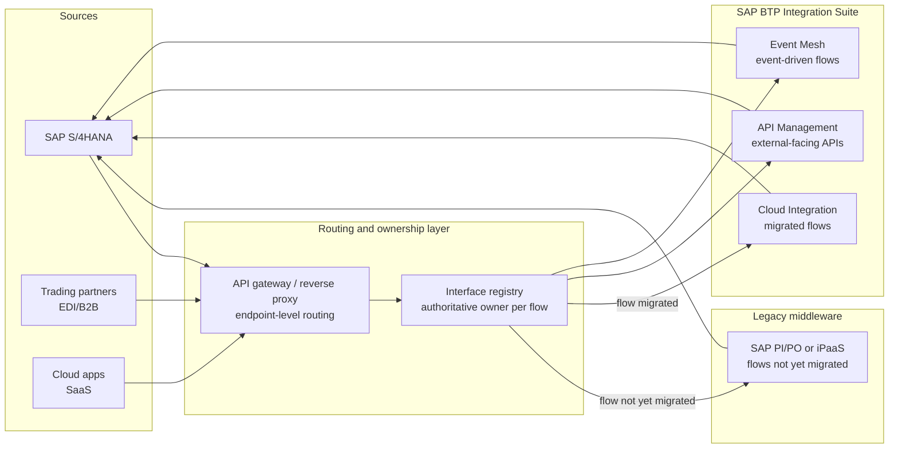

# Hybrid integration: SAP BTP Integration Suite and legacy middleware coexistence

**Domain:** Enterprise integration architecture · SAP BTP · Middleware modernization
**Status:** Reference design, drawn from patterns common in large SAP landscapes migrating off SAP PI/PO or a general-purpose iPaaS.

## The problem

Nobody replaces 150 integration flows in one weekend. Migrating from SAP PI/PO — or from MuleSoft, Boomi, or webMethods sitting in front of SAP — to SAP BTP Integration Suite is a multi-quarter to multi-year program, and the two platforms have to run at the same time for most of it. The naive approach is to migrate flows one at a time and hope nothing depends on which platform currently owns which interface. That works until an interface gets migrated and a downstream consumer was silently depending on PI/PO's specific retry timing, or a partner's firewall rule still points at the old endpoint, or two flows for the same message type end up live on both platforms simultaneously and a message gets processed twice.

The real problem isn't the migration effort itself — it's the lack of a single place that knows which platform currently owns which interface, and what happens to messages in flight during a cutover.

## Architecture

The interface registry is the load-bearing piece, and it is deliberately not a diagram or a spreadsheet that goes stale — it is a queryable source of truth (even a simple database table works) that records, per interface: which platform currently owns it, the cutover date if migration is in progress, and the rollback plan. The API gateway or reverse proxy in front of both platforms routes by that registry rather than by static DNS entries, so a cutover is a registry update and a routing change, not a partner-facing endpoint change.

**Migrate by message type and business criticality, not by platform feature parity.** It's tempting to migrate the easy, low-volume flows first because they're low-risk to test. That produces a migration program that looks like it's progressing while the flows that actually matter — high-volume order-to-cash, anything touching a trading partner's SLA — stay on the legacy platform the longest, which is backwards: those are exactly the flows where the legacy platform's operational knowledge is most valuable and hardest to lose gradually. A better sequencing criterion is blast radius if the migration goes wrong, tested cutover procedure, then business value of being on the modern platform — not raw complexity.

**Dual-run before cutover, not instead of one.** For anything with a partner-facing SLA, run the migrated flow on BTP Integration Suite in shadow mode — processing the same messages, writing to a comparison log, not to production — before it becomes the flow of record. This catches mapping discrepancies and timing differences before a partner notices, and it's the only reliable way to validate that retry and idempotency behavior actually matches, since that's exactly the kind of thing that looks fine in a design review and breaks under real message volume.

**Idempotency has to survive the platform boundary.** If a message can be retried by the legacy platform and then, after cutover, retried again by the new platform because the registry update and the partner's retry didn't happen in the same instant, you need an idempotency key that both platforms check against a shared store — not two independent dedupe mechanisms that don't know about each other.

## When this pattern fits

- Any migration off SAP PI/PO, or off a general-purpose iPaaS, toward SAP BTP Integration Suite, expected to run longer than a single release cycle
- Landscapes with enough interface volume and partner dependencies that a big-bang cutover carries real business risk
- Organizations willing to invest in an interface registry as a real artifact, not documentation that gets written once and ignored

## When it doesn't

- Small landscapes (a handful of interfaces) where a big-bang cutover over a weekend, with a tested rollback, is genuinely simpler than building coexistence infrastructure for a short-lived transition
- Greenfield SAP implementations with no legacy middleware to coexist with — there's nothing to route between

## Related

- [Choosing an integration pattern for SAP landscapes](../decision-guides/choosing-integration-pattern.md)
- [Agentic root-cause copilot for SAP interfaces](02-agentic-root-cause-copilot-for-interfaces.md) — useful during coexistence, when triaging "which platform is this actually failing on" adds a layer of diagnostic complexity
