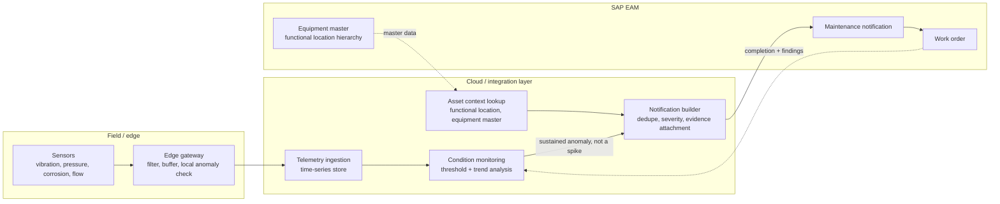

# Field telemetry to SAP EAM for upstream and midstream assets

**Domain:** Industrial IoT · SAP Plant Maintenance / Asset Performance Management · Oil & gas
**Status:** Reference design, drawn from patterns common in upstream and midstream asset-heavy operations.

## The problem

A midstream pipeline network or an upstream production facility generates sensor telemetry constantly — vibration on a compressor, pressure differential across a valve, corrosion probe readings, flow meter drift. Almost none of that data should turn into an SAP Plant Maintenance notification directly. Raw telemetry is noisy: a single vibration spike is usually nothing, and a maintenance planner who gets paged for every sensor blip stops trusting the system within a month and starts ignoring it — which is worse than not having the sensors at all, because now a real signal is buried in noise the team has learned to tune out.

The actual integration problem is turning a continuous, high-volume, noisy signal into a small number of well-justified maintenance notifications, at the right asset, with enough context that a planner can act on it instead of re-investigating it from scratch.

## Architecture

**Filter at the edge, decide in the middle, act only in SAP.** The edge gateway's job is data reduction — sampling, local threshold checks, buffering during connectivity loss on a remote pad or platform, not decision-making. The condition-monitoring layer, running centrally where it has access to historical trends and asset context, decides whether a pattern is worth escalating. SAP EAM only ever receives a notification that has already cleared that bar; it is not where noisy sensor data gets triaged.

**A notification without asset context is worse than no notification.** Sensor IDs live in an IoT platform's namespace; SAP EAM organizes work around functional locations and equipment numbers. The integration has to maintain that mapping as a first-class piece of master data — not a lookup table someone builds once during a pilot and never touches again as assets get added, replaced, or reassigned to a different functional location. When that mapping goes stale, notifications either land against the wrong equipment or fail to create at all, and both failure modes erode trust in the system faster than the sensors ever earn it back.

**Trend, not threshold, for slow-developing failures.** Corrosion and bearing wear don't cross a fixed threshold on the day they become urgent — they trend there over weeks or months. A pure threshold alert catches the day it crosses the line and misses the multi-week trend that would have given a planner time to schedule the work during a planned turnaround instead of an unplanned shutdown. Condition monitoring needs both: threshold alerts for genuine step-changes, and trend detection for gradual degradation, with different urgency framing in the resulting notification.

**Close the loop.** Work order completion codes and technician findings should feed back into the condition-monitoring model — if a notification led to a work order that found nothing wrong, that's a signal the threshold or trend model is too sensitive for that asset class, and it should adjust, not require someone to notice the false-positive pattern manually six months later.

## When this pattern fits

- Upstream and midstream operations with sensor-instrumented rotating equipment, pipelines, or compression assets already reporting into a historian or IoT platform
- Organizations with a reasonably current equipment master and functional location hierarchy in SAP EAM — this pattern amplifies good master data and gets undermined fast by bad master data
- Maintenance teams willing to tune thresholds per asset class rather than apply one global sensitivity setting

## When it doesn't

- Facilities without reliable connectivity for edge-to-cloud telemetry (remote pads with intermittent satellite links need a buffering and reconciliation strategy this document doesn't cover on its own)
- Asset classes without meaningful historical failure data to calibrate trend detection against — a cold-start deployment should lean on OEM-recommended thresholds first and build trend models as history accumulates
- Organizations not yet ready to invest in keeping the sensor-to-functional-location mapping current — see the note above about stale mappings

## Related

- [Multi-ERP master data governance for M&A-heavy asset portfolios](05-multi-erp-master-data-governance-mna.md) — the equipment master and functional location hierarchy this pattern depends on gets harder to keep current across multiple SAP instances after an acquisition or joint venture
- [Agentic root-cause copilot for SAP interfaces](02-agentic-root-cause-copilot-for-interfaces.md) — similar evidence-then-escalate philosophy applied to integration errors instead of asset condition
