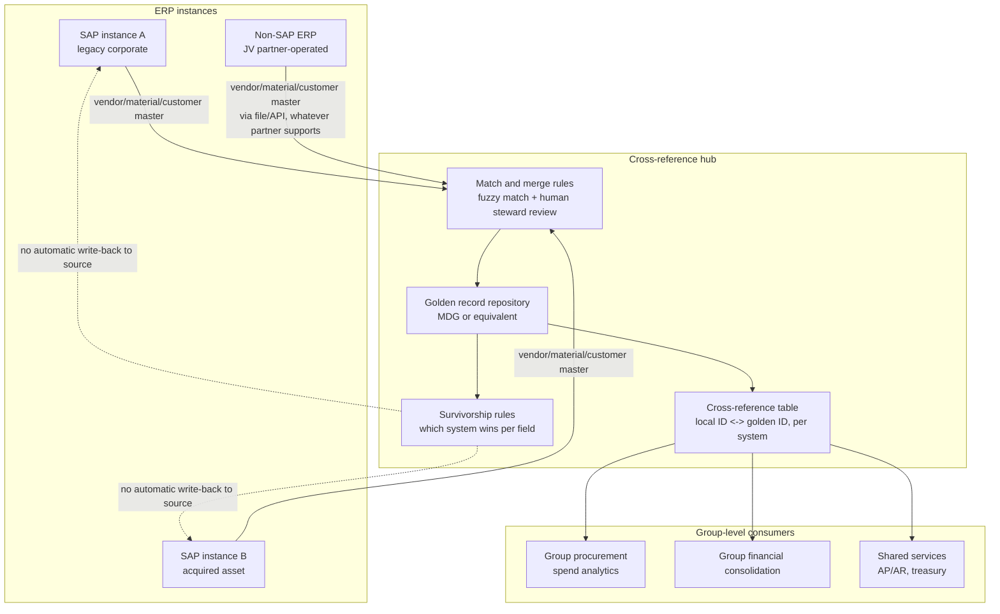

# Master data governance across multiple ERPs in M&A-heavy portfolios

**Domain:** Master Data Governance · Multi-ERP landscapes · Oil & gas / heavy asset industries
**Status:** Reference design, drawn from patterns common in joint-venture and divestiture-heavy asset portfolios.

## The problem

Oil and gas operating companies acquire, divest, and joint-venture assets more often than most industries, and every one of those transactions tends to leave behind a slightly different ERP instance — the acquired asset's legacy SAP system, a joint-venture partner's non-SAP ERP that the operating agreement requires you to keep feeding data to, a divested business unit's system you still need read access to for eighteen months of transition services. Five years after a round of acquisitions, it's common to have the same vendor, the same material, or the same cost center concept represented under three different numbering schemes across three ERP instances, with no reliable way to answer "how much do we actually spend with this vendor group-wide" without a manual reconciliation exercise.

Master Data Governance (MDG) as SAP ships it assumes one governed system feeding N consuming systems. That assumption breaks in an M&A-heavy portfolio, where the honest starting state is N systems that were never governed together, and the goal isn't necessarily to collapse them into one — divested or JV assets may need to keep operating independently — but to establish a reliable cross-reference so group-level reporting and shared services (procurement, treasury) work without asset-by-asset manual mapping.

## Architecture

**Cross-reference before consolidation, and treat them as different projects.** Building a reliable local-ID-to-golden-ID cross-reference is valuable on its own — it unlocks group-level spend and financial reporting immediately. Actually consolidating systems (retiring instance B, migrating its data into instance A) is a separate, much larger, higher-risk project that shouldn't be a prerequisite for getting reporting value. Treating them as one project is the single most common reason these initiatives stall: the team ends up blocked on a multi-year system consolidation before delivering anything.

**No automatic write-back to systems you don't fully control.** For a JV partner-operated ERP or an asset still under transition services from a divestiture, the operating agreement or TSA usually doesn't grant you write access, and even where it technically does, silently overwriting a partner's vendor master from your golden record is a governance and trust problem, not just a technical one. The cross-reference hub reads from these systems and reconciles; it proposes changes back to a human steward on the partner side rather than pushing writes directly.

**Match confidence needs a human-in-the-loop tier, not just a threshold.** Fuzzy matching on vendor name and tax ID gets most matches right automatically. The ones it gets wrong — a vendor that legitimately operates under two different legal names in two countries, versus two genuinely different vendors that happen to share a common name — are exactly the cases with the highest cost if resolved incorrectly (paying the wrong entity, or failing to net exposure across what is actually one counterparty). Auto-merge above a high confidence threshold, queue for steward review in the middle band, and don't merge below it — the same evidence-then-gate principle that should govern any agentic or automated matching decision, applied here to identity resolution instead of transaction risk.

**Survivorship rules need an owner per field, not per record.** "System A wins" as a blanket rule breaks down fast — instance A might be authoritative for tax ID and legal name, while the acquired asset's system B is authoritative for the field-level operational attributes (plant, storage location) that only exist because that system actually runs the asset. Define survivorship at the field level and document why, because the "why" is what a new steward needs six months later when a field looks wrong and they're deciding whether to trust it.

## When this pattern fits

- Organizations with three or more ERP instances as a result of M&A activity, where group-level reporting currently requires manual reconciliation
- Portfolios that include joint ventures or transition-service arrangements where full system consolidation isn't an option, only reconciliation
- A committed data steward function — this pattern shifts effort from one-time data migration to ongoing match review, and needs people assigned to that, not just a tool

## When it doesn't

- A single-ERP organization, or one heading toward genuine system consolidation on a defined timeline — build the cross-reference hub as a bridge, not as permanent infrastructure, if consolidation is actually the end state
- Master data domains with naturally low collision risk (e.g., internal cost centers that were never shared across the merged entities) — don't build a matching pipeline for data that doesn't actually need reconciling

## Related

- [Field telemetry to SAP EAM for upstream and midstream assets](04-iot-to-sap-eam-upstream-midstream.md) — depends on the equipment master and functional location data this pattern helps keep coherent across instances
- [Joint venture cutback and cross-ERP partner billing](07-joint-venture-cutback-cross-erp-billing.md) — the narrower, revenue-specific version of the cross-ERP reconciliation problem this pattern addresses at the master-data level
