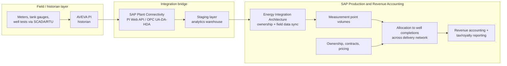

# Field measurement to Production and Revenue Accounting

**Domain:** Upstream oil & gas · SAP Production and Revenue Accounting (PRA) · Industrial historians
**Status:** Reference design, based on SAP's documented PRA architecture and common historian integration practice.

## The problem

A well doesn't report its own production. A measurement point somewhere downstream — a battery, a meter run, a tank gauge — reports a volume, and that volume has to be allocated back across every well completion feeding it, then rolled up into royalty payments, working-interest revenue distribution, and regulatory reporting. SAP's Production and Revenue Accounting (PRA) module handles that allocation, but it doesn't measure anything itself — the measurement lives in field historians like AVEVA PI (formerly OSIsoft PI), which by some estimates sits behind roughly 85% of large upstream operators' SCADA infrastructure.

The integration problem is a mismatch in what each system is built to do. A historian is built to answer "what was the flow rate at this meter at this timestamp," fast, at high frequency, for operational monitoring. PRA is built to answer "how much of this month's allocated volume belongs to this well, this owner, this contract," which requires joining measurement data against ownership, contracts, and allocation hierarchies — the kind of cross-system join a historian's query engine (PI SQL/AF analytics) isn't designed for. Point the two systems directly at each other and you end up either running expensive ad hoc joins against an operational historian, or building brittle point-to-point extracts that break every time a well gets added to a delivery network.

## Architecture

**Stage the data before it reaches PRA — don't integrate the historian directly.** This is the practitioner consensus for a reason: PI is optimized for time-series retrieval at the tag level, not for the relational joins allocation requires (measurement point to well completion to ownership share). A staging layer — even a straightforward warehouse table refreshed daily — that pre-joins measurement readings against the current delivery-network hierarchy gives PRA clean, allocation-ready input instead of forcing it to reach into historian query semantics it wasn't built to speak.

**Allocation is hierarchical, not flat, and the hierarchy changes.** A measurement point sits above a delivery network of multiple well completions, and that network is not static — wells get added, recompleted, or shut in. The integration has to treat "which wells does this measurement point currently allocate to" as its own piece of synchronized master data, refreshed on the same cadence as the volume data itself, or allocations will silently apply to a delivery network that no longer matches the field.

**Late and revised data is the normal case, not the exception.** Field data capture often arrives late — a well test delayed by a workover, a meter recalibration applied retroactively — and month-end close can't simply wait for every number to be final. The architecture needs an explicit reallocation path: when a revised measurement arrives after a period has been allocated and reported, the system needs to reprocess that period's allocation and propagate the correction through revenue accounting, not silently drop the correction or require a manual journal entry to compensate.

## When this pattern fits

- Upstream operations already running a historian (PI or equivalent) with SCADA-connected measurement points feeding a delivery network of multiple wells
- Landscapes where allocation, royalty, and working-interest reporting currently rely on manual spreadsheet reconciliation between the historian and SAP
- Organizations willing to invest in a staging/warehouse layer as permanent infrastructure, not a one-time migration step

## When it doesn't

- Single-well or simple flat-allocation operations, where a direct extract is genuinely sufficient and a staging layer is unneeded complexity
- Landscapes without SAP PRA at all — if revenue accounting runs on a different system, this specific integration pattern doesn't apply, though the staging-before-allocation principle generally does

## Related

- [Joint venture cutback and cross-ERP partner billing](07-joint-venture-cutback-cross-erp-billing.md) — where PRA's revenue output goes next when the well is under a joint venture
- [SAP's oil & gas solution landscape](../decision-guides/sap-oil-gas-solution-landscape.md) — terminology map for PRA, JVA, and the Energy Integration Architecture

## Sources

- [Production and Revenue Accounting — SAP Help Portal](https://help.sap.com/docs/SAP_S4HANA_CLOUD/8bae74e1ba0c4c8cae3a97f15b76ad1e/9e58e0535e56424de10000000a174cb4.html)
- [Creating Measurement Point Volumes — SAP Help Portal](https://help.sap.com/docs/SAP_PRODUCTION_AND_REVENUE_ACCOUNTING/75bc5bb1955345c59bb53d3cc4db9ec2/6e56e0535e56424de10000000a174cb4.html)
- [Installing the OSIsoft PI Web API — SAP Help Portal](https://help.sap.com/docs/PRODUCTION_CONNECTOR/fbfea14aa9b64588897025e49e6a9b03/ea0b688fd52b498fbc81c9403eecea75.html)
- [Databases and Historians for Oil & Gas — Petropt](https://petropt.com/articles/og-databases-historians-guide/)
