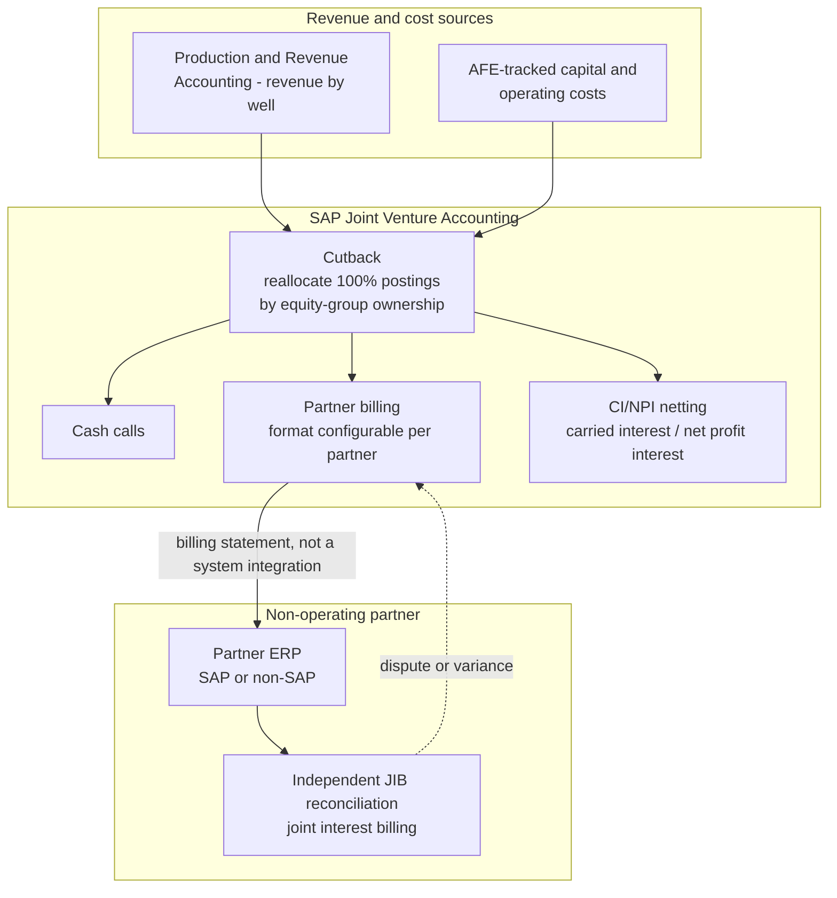

# Joint venture cutback and cross-ERP partner billing

**Domain:** Upstream oil & gas · SAP Joint Venture Accounting (JVA) · Multi-ERP finance
**Status:** Reference design, based on SAP's documented JVA cutback mechanism and common non-operated-venture practice.

## The problem

Almost no upstream asset in oil & gas is owned by one company. A well or field typically has an operating partner who runs day-to-day operations and books the costs, and one or more non-operating partners who hold a working interest and owe their share of costs while being owed their share of revenue — splits defined in a Joint Operating Agreement (JOA). SAP's Joint Venture Accounting handles this on the operator's side through **cutback**: the operator books 100% of a cost or revenue transaction, and cutback reallocates it across partners by their equity share, followed by cash calls and partner billing.

The integration problem shows up at the boundary of what SAP JVA can see. JVA doesn't originate revenue — it receives revenue records from Production and Revenue Accounting or an equivalent upstream source, cuts back costs and revenue by ownership share, and then has to bill non-operating partners who, in a genuinely common real-world case, run a completely different ERP, sometimes a different SAP landscape entirely with no shared master data. The operator's system of record has full visibility into the venture; the partner's system has none, and reconciling "what the operator billed" against "what the partner recorded" becomes a manual, spreadsheet-driven process precisely because there's no shared identity for the well, the AFE, or the cost object across the two systems.

## Architecture

**The billing statement is the integration contract, not a system-to-system link.** Most non-operated venture relationships don't have — and often can't have, given the JOA governs a business relationship between separate legal entities, not a shared IT landscape — a live system integration to the partner's ERP. The realistic architecture treats the JIB (joint interest billing) statement itself, in whatever structured format the partner can consume (a defined EDI format, a structured file, occasionally still a PDF), as the actual integration contract. Investing engineering effort in a well-defined, versioned billing statement format pays off more than trying to build point-to-point connectivity to partners whose systems you don't control and whose relationship with you may end at divestiture.

**AFE identity has to survive the handoff, even when nothing else does.** The Authorization for Expenditure number is usually the one identifier both sides genuinely track independently, because both parties needed to approve the AFE before spend started. Keeping AFE references intact and prominent through cutback, cash calls, and billing gives the non-operating partner's independent reconciliation something concrete to match against, even with zero shared master data otherwise.

**Design for dispute, not just for successful billing.** A partner will periodically flag a variance — their JIB reconciliation doesn't match your cutback output — and the architecture needs a clear path for that: which cost line, which allocation percentage, which period, with full drill-down back to the original 100%-booked transaction. If the audit trail from a disputed billing line back to source postings requires someone to manually reconstruct it, every dispute becomes a multi-day investigation instead of a same-day lookup.

## When this pattern fits

- Any operated venture with one or more non-operating partners billed through SAP JVA cutback
- Portfolios with high AFE volume relative to venture count, where AFE-based traceability delivers the most value
- Organizations already treating the JIB statement as a controlled, versioned artifact rather than an ad hoc export

## When it doesn't

- Wholly-owned assets with no venture partners — there's no cutback problem to solve
- Ventures where the partner relationship includes a genuine shared-system arrangement (rare, but it happens in some strategic joint ventures) — that calls for the [multi-ERP master data governance](05-multi-erp-master-data-governance-mna.md) pattern instead, treating the partner's system as a reconciliation target with real cross-referencing rather than a billing recipient

## Related

- [Field measurement to Production and Revenue Accounting](06-field-measurement-to-production-revenue-accounting.md) — the upstream source of the revenue records JVA cuts back
- [Multi-ERP master data governance for M&A-heavy portfolios](05-multi-erp-master-data-governance-mna.md) — the closer-integration alternative when a shared cross-reference is actually achievable
- [SAP's oil & gas solution landscape](../decision-guides/sap-oil-gas-solution-landscape.md)

## Sources

- [Introduction to Joint Venture Accounting (JVA) — SAP Help Portal](https://help.sap.com/docs/SAP_S4HANA_ON-PREMISE/f049a59301a94f1c9bb60ca8394db217/6066d0531d8b4208e10000000a174cb4.html)
- [Cutback — Joint Venture Accounting (JVA) — SAP Help Portal](https://help.sap.com/docs/SAP_S4HANA_ON-PREMISE/f049a59301a94f1c9bb60ca8394db217/0468d0531d8b4208e10000000a174cb4.html)
- [Introduction to SAP Joint Venture Accounting, Part II — Mastering SAP](https://masteringsap.com/introduction-to-sap-joint-venture-accounting-part-ii/)
- [SAP PRA 101: How to Maximize Oil and Gas Efficiencies — Surety Systems](https://www.suretysystems.com/insights/sap-pra-101-how-to-maximize-oil-and-gas-efficiencies/)
