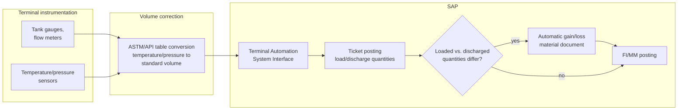

# Terminal measurement to ledger: gain/loss reconciliation

**Domain:** Midstream/downstream oil & gas · SAP Terminal Automation System Interface · Physical-to-contract reconciliation
**Status:** Reference design, based on SAP's documented Terminal Automation System Interface behavior.

## The problem

Hydrocarbon volume changes with temperature and pressure. A tanker loads a cargo at one terminal, discharges it at another days later, and the metered volumes at each end will not match exactly — not because anything was stolen or misrecorded, but because physics doesn't hold a volume constant across a temperature change, and because no meter is perfectly precise. Every terminal operation has to reconcile "what the contract says was sold" against "what the meters actually measured on each end," and post the difference somewhere defensible.

SAP's Terminal Automation System Interface bridges terminal metering equipment (tank gauges, flow meters) into SAP, and per SAP's own documentation, when loaded and discharged quantities differ, the system posts a gain/loss material document automatically — this is standard system logic, not a manual adjustment someone keys in after the fact. The integration challenge is upstream of that posting: getting temperature- and pressure-corrected volumes (using ASTM/API conversion tables) from terminal instrumentation into SAP in a form that's accurate and timely enough for the automatic gain/loss logic to produce a number finance can actually stand behind, rather than a number that looks precise but is built on stale or uncorrected readings.

## Architecture

**Correct volumes before they reach SAP, not after.** ASTM/API volume correction (converting an as-measured volume at ambient temperature and pressure to a standard reference condition) is a well-defined, deterministic calculation, and it belongs as close to the instrumentation as possible — either in the terminal automation system itself or in the integration layer feeding SAP. Sending raw, uncorrected readings into SAP and hoping downstream logic accounts for temperature is how a terminal ends up with gain/loss postings that don't actually reflect physical reality, just measurement noise dressed up as a number.

**A gain/loss posting without a defensible calculation trail is an audit finding waiting to happen.** Because SAP posts the gain/loss automatically, the temptation is to treat it as a black box that "just works." It should instead carry enough evidence — as-measured readings, the correction factors applied, the reference tables used — that when a partner or auditor questions a specific gain/loss line, the answer is a lookup, not a re-derivation. This matters more in oil & gas than most industries because gain/loss variances at scale represent real money, and because custody transfer disputes between counterparties are a normal, expected part of the business, not an edge case.

**Set a materiality threshold and route the rest to review, not to another automatic posting.** Most loads will show a small, expected variance within normal measurement tolerance. A variance well outside that tolerance is a different kind of event — a meter fault, a genuine loss, a data error — and treating it the same as routine variance by posting it automatically hides a problem that should have triggered an investigation. The interface should distinguish "routine, auto-post" from "outside tolerance, flag for review" rather than applying one gain/loss rule uniformly.

## When this pattern fits

- Terminal operations already using the Terminal Automation System Interface or an equivalent metering-to-SAP bridge
- Organizations where gain/loss variance is currently reconciled manually, or where the automatic posting exists but nobody can explain a specific line item on demand
- Custody transfer points where counterparty disputes over volume are a recurring, not hypothetical, business reality

## When it doesn't

- Non-liquid or non-hydrocarbon terminal operations where temperature/pressure correction isn't a factor — the physical reconciliation problem this pattern solves doesn't exist
- Low-volume or single-party operations where manual gain/loss review is genuinely cheaper than building correction and evidence-trail automation

## Related

- [Trading and scheduling orchestration across Commodity Management, TSW, and TM](09-trading-scheduling-orchestration-tsw-tm.md) — the nomination and contract side this reconciliation validates against
- [SAP's oil & gas solution landscape](../decision-guides/sap-oil-gas-solution-landscape.md)

## Sources

- [Terminal Automation System Interface — SAP Help Portal](https://help.sap.com/docs/sap_s4hana_on-premise/0f4ab800d01c4366b0c9aaff06a64320/2c9fcf535b804808e10000000a174cb4.html)
- [Liquid and Gaseous Hydrocarbon Product Management — SAP Help Portal](https://help.sap.com/docs/SAP_S4HANA_ON-PREMISE/0f4ab800d01c4366b0c9aaff06a64320/23c9cc5340487214e10000000a174cb4.html)
- [Petroleum Refinery Production Gain/Loss Posting — SAP Community](https://community.sap.com/t5/sap-for-oil-gas-and-energy-discussions/petroleum-refinery-production-gain-loss-posting/td-p/12245483)
