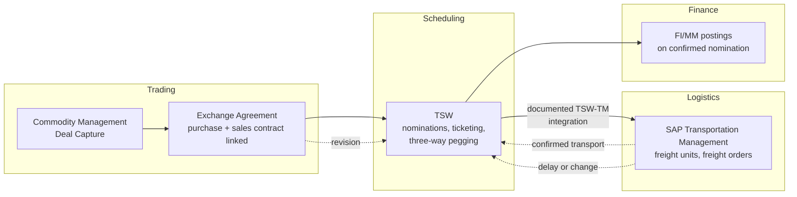

# Trading and scheduling orchestration across Commodity Management, TSW, and TM

**Domain:** Midstream oil & gas · SAP Commodity Management · TSW · Transportation Management
**Status:** Reference design, based on SAP's documented TSW–TM integration and Commodity Management Exchange Agreements.

## The problem

A single physical swap between two counterparties — "you give me a cargo of crude at location A, I give you an equivalent cargo at location B" — touches trading, logistics, and finance as three separate concerns that all have to agree on the same underlying event. The trade itself gets captured as a formal deal, usually now through SAP Commodity Management's Deal Capture option, with an Exchange Agreement structurally linking a purchase contract to a sales contract. That deal has to become a nomination and a schedule in TSW (Trader's and Scheduler's Workbench). The schedule has to become actual transport in SAP Transportation Management — freight units and freight orders. And every step of that chain has to post correctly to FI/MM at the end.

The failure mode isn't any single handoff — SAP has documented integration between TSW and TM, and Commodity Management's Exchange Agreements are specifically built to keep the swap linked. The failure mode is what happens when something changes mid-stream: a nomination gets revised after transport has already been scheduled, a vessel is delayed and the exchange window shifts, or a counterparty renegotiates volume after the freight order is confirmed. Three systems each have their own idea of "what's currently true" about the same physical swap, and without a clear propagation path, a change in one doesn't reliably reach the other two before someone downstream acts on stale information.

## Architecture

**Three-way pegging is the mechanism that keeps this coherent — protect it.** TSW's three-way pegging matches sales deals, purchase deals, and transport against each other explicitly, rather than assuming they'll implicitly line up because they originated from the same trade. When a custom integration or a manual override bypasses the pegging relationship — someone directly edits a freight order without going back through TSW, for instance — that's exactly the kind of change that leaves the trade, the schedule, and the transport disagreeing about reality, silently, until someone reconciles them by hand.

**Revisions have to flow one direction: from the trade, through scheduling, into transport — never the other way as a silent side-channel.** If a vessel delay in TM needs to change the nominated schedule, that has to happen by revising the nomination in TSW, which then propagates to a new freight order — not by quietly editing the freight order and leaving TSW's record of the schedule stale. The trade is the source of truth for what was agreed; transport execution reflects it, and any operational reality that contradicts the plan needs to be reconciled back through the scheduling layer, not patched around it.

**Confirm before you post to finance.** FI/MM postings should trigger off a confirmed nomination, not a tentative one. A nomination that's still subject to change and already has downstream financial postings against it creates exactly the kind of reversal-and-rebook cycle that makes month-end close painful and makes it hard to trust FI numbers as final until well after the fact.

## When this pattern fits

- Trading operations using SAP Commodity Management, TSW, and TM together, or evaluating that combination against a patchwork of spreadsheets and manual handoffs
- Physical swap or exchange agreements where keeping the linkage between purchase and sales sides intact through execution is a genuine operational requirement
- Organizations experiencing reconciliation pain specifically at the trade-to-transport or transport-to-finance boundary

## When it doesn't

- Purely financial (paper) trading with no physical transport leg — TSW and TM's coordination problem doesn't apply
- Simple, single-location deals with no exchange or swap structure, where a lighter-weight process is genuinely sufficient

## Related

- [Terminal measurement to ledger: gain/loss reconciliation](08-terminal-measurement-gain-loss-reconciliation.md) — the physical measurement this trading chain ultimately has to reconcile against
- [SAP's oil & gas solution landscape](../decision-guides/sap-oil-gas-solution-landscape.md)

## Sources

- [TSW — Trader's and Scheduler's Workbench — SAP Help Portal](https://help.sap.com/docs/SAP_S4HANA_ON-PREMISE/9609b5f9e9304ef6850945b359a1f5d4/b7a0cf535b804808e10000000a174cb4.html)
- [Exchange Agreements, SAP Commodity Management Option for Deal Capture — SAP Help Portal](https://help.sap.com/docs/SAP_COMMODITY_MANAGEMENT_OPTION_FOR_DEAL_CAPTURE_FOR_SAP_S4_HANA/3b2ce84e99214101a01d1ba15f459b00/028fe5a239a642bcb8e52a6bee551e7d.html)
- [SAP ACM and SAP TSW Integration with SAP TM on S/4HANA — LeverX case study](https://leverx.com/case-studies/sap-acm-and-sap-tsw-integration-with-sap-tm-on-sap-s4hana-for-a-manufacturing-provider)
- [Scheduling Oil and Gas Trades — An SAP TSW Perspective — SAPinsider](https://sapinsider.org/scheduling-oil-and-gas-trades-an-sap-tsw-perspective/)
