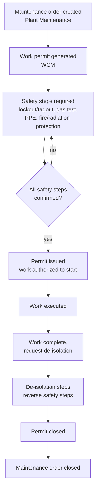

# Permit-to-work as a safety gate on Plant Maintenance

**Domain:** Asset-intensive / high-hazard industries · SAP Work Clearance Management (PM-WCM) · Plant Maintenance
**Status:** Reference design, based on SAP's documented WCM-PM integration.

## The problem

In a refinery, a pipeline right-of-way, or a production facility, "issue a work order" and "it is safe to start this work" are not the same decision, and treating them as one is how people get hurt. Before a technician can isolate a line, open a vessel, or work near an energized system, someone has to verify lockout/tagout is applied, gas testing is clear, the right PPE and fire watch are in place, and the isolation boundary actually matches the equipment the work order describes. Doing this well requires that the safety process and the maintenance process share the same understanding of the equipment and the work — not two separate systems that happen to reference the same asset by different means.

SAP addresses this natively: Work Clearance Management (WCM) is part of Plant Maintenance, not a bolt-on integration, and the permit lifecycle is a defined state machine tied directly to the maintenance order — work order generates a permit, safety steps gate the permit, permit closure allows de-isolation and work-order closure. The design problem most organizations actually face isn't building this integration (SAP already provides it) — it's configuring the state machine correctly for their specific hazard profile and not treating WCM as an optional add-on that can be bypassed under schedule pressure.

## Architecture

**The permit and the work order share one identity, on purpose.** Because WCM is native to Plant Maintenance rather than middleware-bridged, there's no reconciliation problem between "what the work order says the scope is" and "what the permit says was authorized" — they're the same equipment, functional location, and order reference throughout. The design discipline this demands is on the configuration side: safety step templates need to actually match the hazard class of the equipment and work type, not a generic checklist applied uniformly, or the permit becomes a formality rather than a real gate.

**Sequence matters more than completeness.** A permit with every safety step eventually checked but no enforced order — gas testing confirmed after work already started, for instance — provides the appearance of control without the substance. The state machine should enforce that steps happen in the sequence the hazard actually requires (isolate, then verify, then authorize), not just that all steps get checked off before permit closure.

**De-isolation is not an afterthought — model it as its own gated sequence.** The temptation in a lot of process designs is to treat closing the permit as simply reversing whatever the opening sequence did, in whatever order is convenient. Real de-isolation often has its own required sequence and its own verification (confirming a line is actually depressurized before removing a blind, for instance), and it deserves the same explicit step-by-step modeling as the opening sequence — a work order that's closed while equipment is left in an intermediate, unsafe state is a direct consequence of treating de-isolation as symmetric cleanup rather than its own controlled process.

## When this pattern fits

- Facilities with hazardous work — hot work, confined space entry, energy isolation — already using or evaluating SAP Plant Maintenance for work order management
- Organizations where permit-to-work currently runs on paper or in a disconnected system, creating exactly the work-order-vs-permit reconciliation gap this pattern eliminates
- Environments with a genuine, defined hazard classification scheme to drive differentiated safety step templates — this pattern's value scales with how well that classification actually reflects real risk differences

## When it doesn't

- Low-hazard maintenance work (routine, non-isolating tasks) where a full permit-to-work state machine is disproportionate process overhead
- Organizations not using SAP Plant Maintenance for work order management — WCM's value comes specifically from being native to PM, and doesn't transfer cleanly to a different work-order system

## Related

- [Field telemetry to SAP EAM for upstream and midstream assets](04-iot-to-sap-eam-upstream-midstream.md) — the condition-monitoring source that often triggers the maintenance orders this pattern gates
- [SAP's oil & gas solution landscape](../decision-guides/sap-oil-gas-solution-landscape.md)

## Sources

- [SAP Work Clearance Management (Permit to Work): Making Maintenance Safer and Compliant — SAP Community](https://community.sap.com/t5/supply-chain-management-blog-posts-by-sap/sap-work-clearance-management-permit-to-work-making-maintenance-safer-and/ba-p/14386858)
- [Implementing Permit to Work with SAP WCM in S/4HANA – Part 3 — SAP Community](https://community.sap.com/t5/enterprise-resource-planning-blog-posts-by-sap/implementing-permit-to-work-with-sap-wcm-in-s-4hana-part-3/ba-p/13451731)
