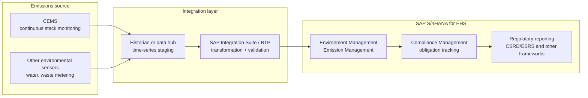

# Bridging continuous emissions monitoring into SAP Environment Management

**Domain:** Oil & gas / process industries · Environmental compliance · SAP Integration Suite
**Status:** Reference design for a gap in SAP's out-of-box connectivity — this is deliberately a "build it" pattern, not a "configure it" pattern.

## The problem

Emissions reporting has gotten less optional. Regulatory reporting obligations and frameworks like CSRD/ESRS expect emissions data that's traceable back to the source, not a spreadsheet someone assembled once a quarter from whatever readings were easiest to find. SAP's Environment Management and Emission Management capabilities (part of SAP S/4HANA for EHS) are built to track GHG and air-pollutant emissions, water and wastewater, and waste, and to feed that into compliance reporting. What they don't provide, at least not as a documented out-of-box connector, is a defined path from a Continuous Emissions Monitoring System (CEMS) — the actual hardware measuring stack emissions in real time — into that SAP capability.

This is worth stating plainly rather than papering over: this is a real gap, not a documentation oversight. It means the integration has to be built, and it means the temptation to treat emissions data ingestion as an afterthought — a quarterly manual upload — is exactly how a company ends up with an emissions compliance process that can't survive an audit asking "show me how this number was calculated from source measurements."

## Architecture

**Treat this as a genuine integration build, with the same rigor as a financial interface, not a data-import script.** Because there's no SAP-provided connector, it's tempting to build the thinnest possible bridge — a scheduled file drop, a quick script. Emissions data feeding a regulatory filing deserves the same integration discipline as a financial posting: defined data contracts, validation before ingestion, an audit trail from the SAP-side emissions record back to the specific CEMS reading and timestamp it came from. Regulators and auditors will ask for that trail; a script nobody documented won't provide it.

**Stage and validate before ingestion, the same discipline as the field-measurement-to-PRA pattern.** CEMS data has its own failure modes — sensor drift, calibration gaps, communication dropouts — and Emission Management needs to receive data that's already been checked for plausibility (is this reading within a physically sensible range, is there a gap in the time series that needs flagging rather than silently interpolating), not raw sensor output. A staging layer that validates and flags anomalies before data reaches the compliance record is what turns "we have emissions data" into "we have emissions data we can defend."

**Design the audit trail backwards from the regulatory question, not forwards from the sensor.** Start from "if an auditor asks how this quarter's reported emissions figure was derived, what has to be retrievable" and build the integration to satisfy that question, rather than starting from what the CEMS happens to output and hoping it's sufficient. This usually means preserving raw readings alongside any calculated or aggregated figures, not just the final number that flows into the compliance report.

## When this pattern fits

- Facilities with CEMS or equivalent continuous environmental monitoring, and a genuine regulatory reporting obligation tied to that data
- Organizations running SAP S/4HANA for EHS / Environment Management already, looking to close the gap between field monitoring and compliance reporting
- Compliance functions currently relying on manual data assembly for emissions reporting who want that process to survive an audit

## When it doesn't

- Facilities without continuous monitoring — periodic manual sampling doesn't have the same real-time integration problem, though it still benefits from a defined, auditable data path
- Organizations not using SAP for environmental compliance reporting — the audit-trail-backwards design principle applies generally, but this specific SAP-side architecture doesn't

## Related

- [Field measurement to Production and Revenue Accounting](06-field-measurement-to-production-revenue-accounting.md) — the same stage-and-validate discipline applied to a different SAP module
- [Field telemetry to SAP EAM for upstream and midstream assets](04-iot-to-sap-eam-upstream-midstream.md) — a parallel condition-monitoring integration, though EAM tolerates more false positives than a regulatory filing can
- [SAP's oil & gas solution landscape](../decision-guides/sap-oil-gas-solution-landscape.md)

## Sources

- [Strategy Update: The Next Evolutionary Step of SAP S/4HANA for EHS — SAP News](https://news.sap.com/2025/07/strategy-update-sap-s4hana-ehs/)
- [SAP EHS Environment Management — environmental responsibility and regulatory compliance — SAP Community](https://community.sap.com/t5/sustainability-blog-posts/sap-ehs-environment-management-environmental-responsibility-and-regulatory/ba-p/14173083)
- [How SAP Integration Suite Supports the Oil and Gas Industry — SAP](https://www.sap.com/blogs/how-sap-integration-suite-supports-the-oil-and-gas-industry)

*Note: this architecture addresses a documented gap rather than a documented connector — if SAP or a partner has since published a native CEMS integration, verify current SAP Help Portal content before treating this as the only option.*
