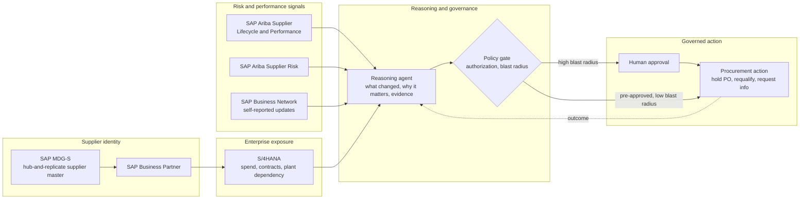

# Agentic supplier risk and performance reasoning

**Domain:** Procurement · SAP Ariba · Master data · Agentic AI
**Status:** Reference design, based on SAP's documented Ariba Supplier Lifecycle and Performance, Supplier Risk, and MDG-S integration.

## The problem

Supplier risk and performance data lives in at least four places that don't naturally talk to each other in a way a buyer can act on. SAP Ariba Supplier Risk carries risk indicators. SAP Ariba Supplier Lifecycle and Performance (SLP) carries onboarding, qualification, and performance history. SAP Business Network carries self-reported updates the supplier submits directly. S/4HANA carries the only thing that says whether any of this actually matters to your business: spend, active contracts, and which plants or projects depend on that supplier. A risk score by itself doesn't tell a buyer anything actionable — the same drop in a supplier's risk rating means something completely different for a $50K commodity vendor with three alternates than for a sole-source supplier feeding a single critical asset.

The manual version of this — a buyer or category manager cross-referencing four portals every time a risk alert fires — doesn't scale past a small supplier base, and it doesn't happen consistently even when someone tries, because the volume of alerts eventually outpaces the willingness to open four systems per alert. The other failure mode is worse: treating a raw risk score as a trigger for automatic action skips the step where someone establishes that the risk is actually relevant to this company's specific exposure, and skips the governance step of who's allowed to act on it.

## Architecture

**Supplier identity has to be governed before reasoning can be trusted.** MDG-S's hub-and-replicate model exists precisely because Ariba, S/4HANA, and Business Network each maintain their own supplier records, and without a resolved single identity across them, risk reasoning either scores the wrong entity or double-counts a supplier operating under two legal names. This is the [multi-ERP master data governance](05-multi-erp-master-data-governance-mna.md) problem, applied specifically to supplier identity rather than a cross-ERP acquisition.

**A risk score means nothing without exposure context.** The reasoning agent's actual job is joining an Ariba Supplier Risk signal against S/4HANA spend, active contracts, and plant or project dependency before it becomes a recommendation. Skipping this step is how a minor rating change on a low-exposure vendor gets the same escalation treatment as a real problem at a sole-source supplier — noise and signal end up indistinguishable.

**Self-reported evidence needs a trust discount, not equal weight.** A supplier's own update through Business Network — "we've resolved the compliance issue" — is weaker evidence than an independently verified change in Ariba Supplier Risk. The reasoning agent should weight sources by how they were verified, not by how recent they are; treating a self-attestation as equivalent to third-party verification is an easy way to close out a real risk prematurely.

**The agent explains; the policy gate authorizes.** Consistent with [ADR-001](../decisions/adr-001-agents-recommend-policy-gates-authorize.md), the reasoning agent's output is a recommendation with evidence attached — hold a purchase order, request updated documentation, initiate requalification — not an executed action. Whether that recommendation needs human sign-off depends on blast radius per [ADR-003](../decisions/adr-003-human-approval-scales-with-blast-radius.md): requesting documentation from a supplier is low-risk and reversible; suspending a sole-source supplier is not, regardless of how confident the agent is.

## When this pattern fits

- Organizations already running Ariba SLP and Supplier Risk alongside S/4HANA, where risk review currently means a person manually cross-referencing multiple portals per alert
- Procurement organizations with a high supplier-to-reviewer ratio, where consistent manual review of every risk signal against exposure isn't realistically happening today
- Oil & gas and other heavy-asset industries specifically: sole-source suppliers for critical equipment, joint-venture partner-nominated vendors, and safety-critical qualification requirements make the exposure-context step higher-stakes than in general commodity procurement

## When it doesn't

- Small supplier bases where a person can reasonably review every risk signal directly — the coordination cost of a reasoning layer isn't worth it yet
- Organizations without MDG-S or an equivalent governed supplier identity — the reasoning layer will reason confidently over fragmented or duplicate identities, which is worse than doing nothing

## Related

- [Multi-ERP master data governance for M&A-heavy portfolios](05-multi-erp-master-data-governance-mna.md) — the same identity-resolution discipline applied to a cross-ERP acquisition instead of supplier records
- [ADR-001: Agents recommend; deterministic policy gates authorize](../decisions/adr-001-agents-recommend-policy-gates-authorize.md) and [ADR-003: Human approval scales with blast radius](../decisions/adr-003-human-approval-scales-with-blast-radius.md)
- [Guardrails for agentic AI in ERP](../decision-guides/agentic-ai-guardrails-for-erp.md)

## Sources

- [Business Partner Master Data (LO-MD-BP) — SAP Help Portal](https://help.sap.com/docs/SAP_S4HANA_ON-PREMISE/3cb1182b4a184bdd93f8d62e3f1f0741/af6fbd534f22b44ce10000000a174cb4.html)
- [Master Data Governance for Business Partner (MDG-BP) — SAP Help Portal](https://help.sap.com/docs/SAP_MASTER_DATA_GOVERNANCE/e605401fa254458cbe47498c514d42ce/02632952d75afa1ce10000000a423f68.html)
- [Configuring Master Data Governance for Supplier — SAP Help Portal](https://help.sap.com/docs/PRODUCT_ID/d6bbe43b03894e4f817c8b939d532744/31429d5254a43258e10000000a423f68.html)
- [SAP Ariba Supplier Lifecycle and Performance & Supplier Risk — Release Highlights, SAP Community](https://community.sap.com/t5/spend-management-blog-posts-by-sap/sap-ariba-supplier-lifecycle-and-performance-amp-supplier-risk-2411-release/ba-p/13916186)
