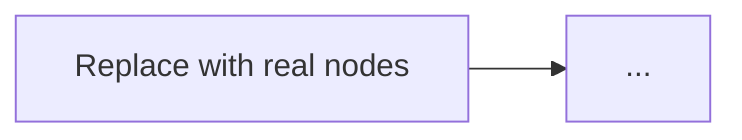

# <Architecture title>

**Domain:** <e.g. SAP FI/CO · Agentic AI · Governance>
**Status:** <Conceptual reference architecture / Reference design / whatever is actually true — do not overclaim validation>

## The problem

<What actually goes wrong today, in concrete terms, for someone doing this work. Not a restated feature list. Name the specific failure mode, not "efficiency" or "visibility.">

## Architecture

<One or two sentences on the core idea before the diagram.>

<Two to four design decisions that matter most, each as a bolded lead-in sentence followed by why. Not a bulleted feature list — explain the actual tradeoff and what happens if you get it wrong.>

## When this pattern fits

- <Concrete condition, not "when you need efficiency">
- <...>

## When it doesn't

- <Be honest here — this section is what makes the doc trustworthy>
- <...>

## Related

- [Other architecture](../architectures/0X-other.md) — why it's related, one clause
- [Decision guide](../decision-guides/some-guide.md)

<!--
Checklist before opening a PR with this doc:
- [ ] Every claim is either general architectural reasoning or attributed to a real, checkable source
- [ ] No specific metrics/numbers from unpublished research or confidential engagements
- [ ] Mermaid diagram uses only nodes/edges, no external image references
- [ ] Ran scripts/check-links.sh from the repo root and it passed
- [ ] Added this doc to the table in README.md
-->
